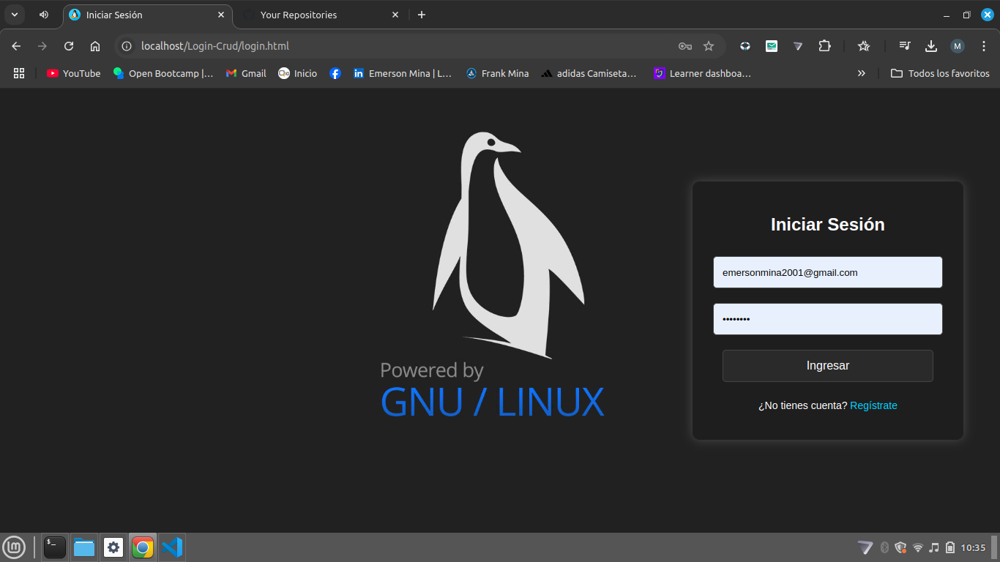

# Sistema de Gestión de Usuarios - CRUD en PHP y MySQL  

  

## 📌 Descripción  
Este proyecto es un **CRUD (Create, Read, Update, Delete)** de usuarios desarrollado en **PHP y MySQL**, utilizando **XAMPP** para el servidor local y **phpMyAdmin** para la gestión de la base de datos.  

### Características:  
- Registro de nuevos usuarios.  
- Inicio de sesión.  
- Edición de perfil.  
- Eliminación de cuenta.  

## 🚀 Tecnologías Utilizadas  
- **PHP 8.x**  
- **MySQL 8.x**  
- **XAMPP** ([Descargar aquí](https://www.apachefriends.org/es/index.html))  
- **phpMyAdmin** ([Docker Hub](https://hub.docker.com/_/phpmyadmin))  
- **HTML, CSS y JavaScript**  

## 📥 Instalación  

### 1️⃣ Descargar e Instalar XAMPP  
Descarga e instala **XAMPP** desde el siguiente enlace:  
🔗 [https://www.apachefriends.org/es/index.html](https://www.apachefriends.org/es/index.html)  

### 2️⃣ Clonar el Repositorio  
Ejecuta el siguiente comando en la terminal:  
```bash
git clone https://github.com/Emerson-Mina/Crud_Emerson_Mina.git
```

### 2️⃣ Mover carpeta del proyecto a la carpeta htdocs
Ejecuta el siguiente comando en la terminal:  
```bash
sudo mv Crud_Emerson_Mina /opt/lampp/htdocs/Login-Crud
```
